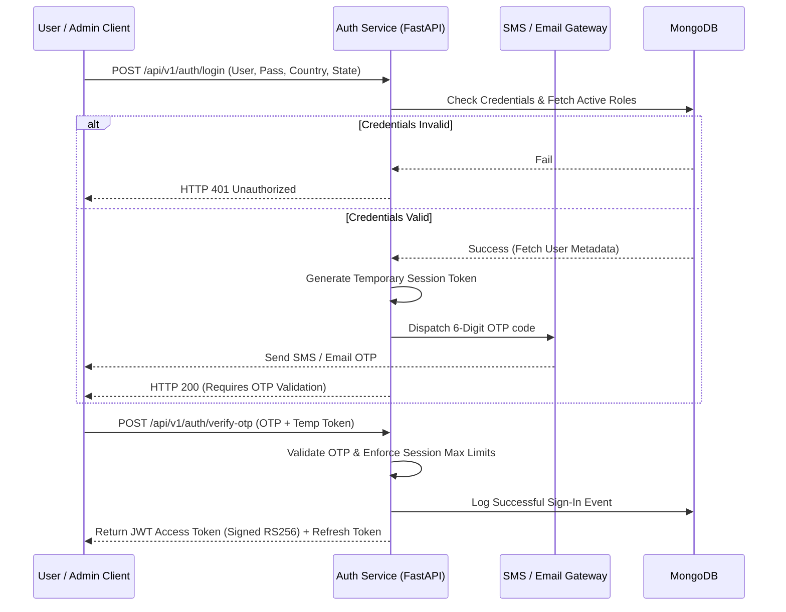
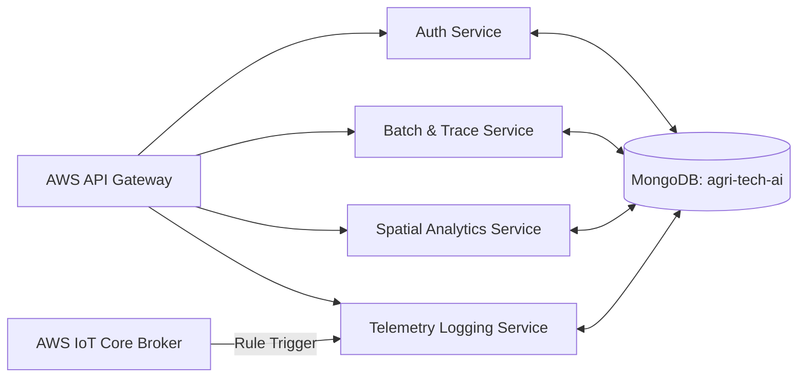
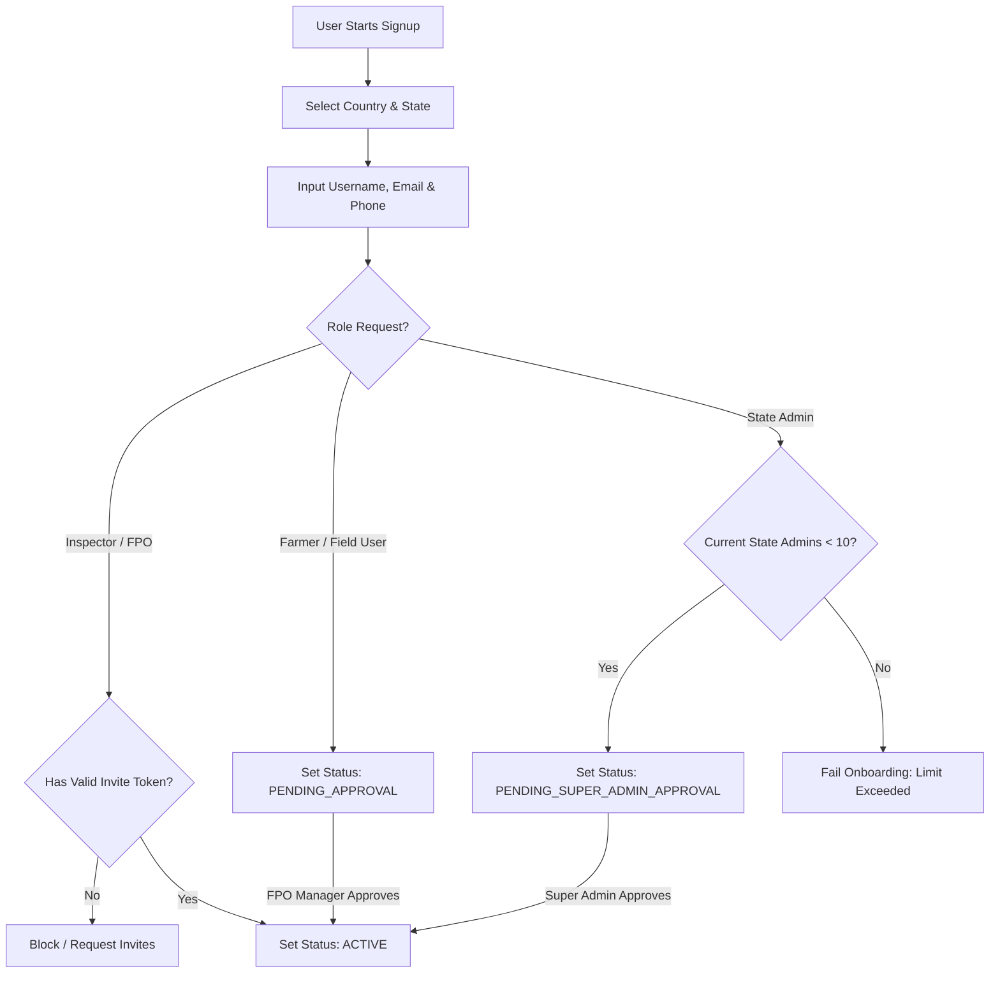

# Enterprise Architecture Specification: AIoT Agri-Health Guardian Platform

**Version:** 3.0.0  
**Status:** Approved Enterprise Blueprint  
**Target Hardware:** ESP32-S3 (ESP-IDF v5.1 FreeRTOS SMP) + OV2640 Edge Nodes  
**Cloud Stack:** AWS Multi-Region Deployment, FastAPI (Python 3.11), MongoDB (agri-tech-ai), Flutter 3.x  

---

## 1. Abstract

The **AIoT-enabled Agri-Health Guardian Platform** is a production-grade, enterprise-scale software architecture designed to bridge the gap between decentralized edge sensing and global agricultural intelligence. Intended for deployment in rural settings across multiple nations, this platform integrates localized crop-grading logic and microclimate actuation with national policy compliance, regional cooperative (FPO) management, and global trade traceability. By combining **on-device LiteRT/TensorFlow Lite Micro models** with **MongoDB geospatial indexing** and a **multi-region cloud infrastructure**, the system guarantees **offline-first reliability**, **cryptographic data provenance**, and **role-based comparative insights** across multiple states and countries.

---

## 2. System Overview

The Agri-Health Guardian Platform is structured around a hybrid edge-cloud paradigm to address the core challenges of rural infrastructure: **extreme microclimate shifts**, **erratic power networks**, and **patchy cellular coverage**. 

* **The Edge (Perception & Control Layer):** Self-contained, solar-powered ESP32-S3 microcontroller nodes collect telemetry (DHT31, NDIR CO2, Analog pH/moisture) and process visual frames (OV2640 camera). Visual grading and spoilage risk are calculated locally on-device. Relays, servo gates, and PWM humidifiers react locally with sub-250ms latency using a deterministic FreeRTOS state machine.
* **The Transit Layer (Network):** When cellular or local WiFi is active, the edge node streams telemetry via MQTT over TLS 1.3 to AWS IoT Core. If offline, the node queues data in a local, wear-leveled SQLite database, executing bulk-synchronization with backoff throttling once connectivity is restored.
* **The Core Cloud (API & Spatial Layer):** AWS API Gateways route payloads to FastAPI microservices. Records are stashed in a multi-region MongoDB database, utilizing **MongoDB Geospatial Indexing (GeoJSON $near, $geoWithin)** for spatial calculations (e.g. proximity-to-coast corrosion profiling, K-Means farm clustering).
* **The Presentation Layer (UI & Roles):** Multi-role Flutter mobile, tablet, and web clients access the API Gateway via OAuth2 JWT authentication. Users are restricted to geo-fenced dashboard scopes depending on their administrative country or state boundary.

```
+---------------------------------------------------------------------------------------------------+
|                                     PRESENTATION LAYER (Flutter 3.x)                              |
|   [Farmer Mobile App]       [FPO Tablet Dashboard]       [Inspector Portal]     [Super Admin Console] |
+-------------------------------------------------^-------------------------------------------------+
                                                  | HTTPS / WSS (OAuth2 JWT)
+-------------------------------------------------v-------------------------------------------------+
|                                 ENTERPRISE API GATEWAY (AWS API Gateway)                           |
+-------------------------------------------------^-------------------------------------------------+
                                                  |
+-------------------------------------------------v-------------------------------------------------+
|                             APPLICATION LAYER (FastAPI Microservices)                             |
|   [Auth & RBAC]     [Produce Registry]     [Spatial Analytics]     [Alerts & Notification Engine] |
+-------------------------------------------------^-------------------------------------------------+
                                                  |
+-------------------------------------------------v-------------------------------------------------+
|                                 DATA LAYER (MongoDB: agri-tech-ai)                                |
|   [(Users & Roles)]     [(Geo Farms)]     [(Traceability Chaining)]     [(Telemetry Timeseries)]  |
+-------------------------------------------------^-------------------------------------------------+
                                                  | SQL / Streams
+-------------------------------------------------v-------------------------------------------------+
|                                  AWS IOT CORE (MQTT TLS 1.3 Broker)                               |
+-------------------------------------------------^-------------------------------------------------+
                                                  | MQTT over TLS 1.3 (Mutual X.509 Auth)
+-------------------------------------------------v-------------------------------------------------+
|                            EDGE COMPUTATION LAYER (ESP32-S3 SMP FreeRTOS)                         |
|   [Core 0: Comm & PID Relays]    [Core 1: Camera DMA]    [Core 1: TFLite Micro Inference Task]    |
+---------------------------------------------------------------------------------------------------+
```

---

## 3. User Roles and Login Architecture

### 3.1 User Role Definitions
The platform implements nine discrete roles within a strict Role-Based Access Control (RBAC) hierarchy:

1. **Super Admin:** Global system administrators. They have unrestricted read/write access to all database tables, global analytics, system configurations, and security policies across all countries and states.
2. **Country Admin:** Assigned to a single country (e.g. Country Admin - India). They manage all states within that country, oversee national compliance parameters, and view aggregated country-level dashboards.
3. **State Admin:** Government or corporate regional operators. Each state is restricted to a **maximum of 10 State Admins** to prevent licensing abuse and maintain a tight chain of custody. They approve local users (District Admins, Inspectors), register FPOs, and generate state compliance audits.
4. **District / Region Admin:** Local municipal coordinators. They approve farmer signups, manage local cold-storage facilities, and coordinate physical responses to environmental or crop health alerts.
5. **Farmer / Field User:** Primary producers. They register harvest batches, onboarding crop details and GPS tags. They view live sensors on their farm, receive local FSM alerts, and view weather-adapted agronomic recommendations.
6. **FPO / Cooperative Manager:** Operations heads for Farmer Producer Organizations. They oversee multiple farms, monitor sorting conveyors, review TFLite grading yields, manage logistics batches, and trace shipments.
7. **Inspector / Regulator:** Safety auditors (e.g., FSSAI inspectors). They scan QR codes in the field to trace the cryptographic batch chain, view sensor history logs for cold-storage facilities, and issue compliance flags.
8. **Buyer / Consumer:** Wholesalers, retail buyers, or end consumers. They access public endpoints by scanning produce QR codes, viewing quality parameters, harvest coordinates, crop grade distribution, and temperature safety history.
9. **Analyst / Scientist:** Data users. They access anonymized regional telemetry and batch quality aggregates to train models, predict crop yields, evaluate climate risks, and publish regional advisory parameters.

### 3.2 Secure Login & Invitation Lifecycle
To guarantee security across rural and enterprise operations, the platform utilizes a multi-factor authentication flow:



#### User Onboarding and Invite Workflows:
* **Invites:** Government officials, FPO managers, and state inspectors must be invited by a State Admin or Country Admin. An invitation creates a temporary record in the `user_invitations` table with a secure, 32-character token. The recipient clicks the link, selects their language, registers their username/password, and undergoes OTP verification.
* **Farmer Registration:** Farmers can self-register via the mobile client. During signup, they select their country, state, district, and FPO. Accounts remain in a `PENDING_APPROVAL` status until a District Admin or FPO Manager verifies their identity and farm ownership.

### 3.3 Authorization Rules & Enforcements
* **Scope Enforcements:** Every JWT access token contains the user's role and geographic boundaries:
  ```json
  {
    "sub": "ramesh_patra_99",
    "role": "STATE_ADMIN",
    "country_id": "IND",
    "state_id": "MH",
    "exp": 1781390000
  }
  ```
  API endpoint handlers use decorators to inspect scopes. For example, a request from `ramesh_patra_99` to read farm data in the state of Karnataka (`KA`) is blocked with an HTTP 403 Forbidden.
* **State Admin Constraint (Max 10 per State):** Database triggers and API validation checks run before any user is assigned the role of `STATE_ADMIN`. If the count of active state admins for `state_id` equals 10, the insert transaction is aborted.

---

## 4. Multi-Country and Multi-State Support

The system is structurally organized around a geographic database hierarchy to support global deployment.

```
       +---------------------------------------------+
       |             Global Dashboard                |
       +----------------------|----------------------+
                              |
              +---------------+---------------+
              |                               |
    +---------v---------+           +---------v---------+
    |   Country: India  |           |   Country: Kenya  |
    +---------|---------+           +---------|---------+
              |                               |
      +-------+-------+               +-------+-------+
      |               |               |               |
 +----v----+     +----v----+     +----v----+     +----v----+
 |State: MH|     |State: KA|     |State: NBI|    |State: MSA|
 +----|----+     +----+----+     +----+----+     +----+----+
      |               |               |               |
  District        District        District        District
      |               |               |               |
   Farms           Farms           Farms           Farms
```

### 4.1 Country & State Configurations
Each country has localized configurations stored in the `countries` collection in MongoDB, governing:
* **Locale & Language:** Defaults to local dialects (e.g. Marathi/Hindi in Maharashtra, Kannada in Karnataka) with automatic translation using PO/MO files.
* **Compliance Overrides:** Standardized safety parameters (e.g. EU export pesticide thresholds vs FSSAI India local standards).
* **Crop Profile Mappings:** Cultivars and harvesting stages dynamically shift based on the selected country (e.g., Alphonso mangoes in India vs Kent mangoes in Brazil).
* **Geospatial Reference:** Bounding coordinates to filter spatial queries and optimize map layers.

### 4.2 Localized Weather & Soil Adaptations
The system connects to regional weather APIs (e.g. IMD for India, NOAA for US) and soil databases (e.g. ICAR Soil Portal) using the geolocation coordinates of the farm.
* **Inland Dry Zones:** Actuator setpoints prioritize humidity conservation, and PID loops open flaps only when ambient moisture is favorable.
* **Coastal/Monsoon Zones:** High humidity triggers fans earlier to prevent fungal outbreaks, and soil EC targets adjust to accommodate salt-mist deposits.

### 4.3 External Geo-Data Sourcing & Ingestion Rules
For production-grade geospatial intelligence and profiling, the system relies on real-world, source-backed datasets integrated into our spatial and soil profiling layers:
1. **Soil properties** (including pH, organic carbon, clay/sand/silt percentages, and salinity) are sourced from the **ISRIC SoilGrids 250m REST API**. This provides global soil property maps at 250m resolution.
2. **Elevation** is sourced from the **OpenTopography/SRTM (30m/90m)** global elevation datasets, providing precise topographic measurements.
3. **Distance from the ocean/coastline** is computed dynamically using **Natural Earth 1:10m Physical Coastline Vector** geometry. This enables the calculation of coastal salt-mist risk factors.
4. **Startup Country Ecosystem Index** is sourced from the **StartupBlink Global Startup Ecosystem Index** (covering 100 countries and 1,000 cities) to evaluate agricultural ecosystem health. It is stored as `startup_ecosystem_rank`, `source`, and `last_updated`.

---

## 5. Global AgriTech Integration

The platform includes a **Comparative Intelligence Engine** that integrates best practices from ten leading agricultural technology nations. Users (primarily FPO Managers and Analysts) can review comparative adoption indices and import proven operational rules to their local deployments:

| Country | Primary Technical Strength | Core Innovation Mechanism | Target Climate Zone | Local Adaptation / Import Pattern |
| :--- | :--- | :--- | :--- | :--- |
| **United States** | Satellite Remote Sensing | High-resolution NDVI, carbon credit tracing, autonomous tractor fleets. | Temperate Arable | Run automated satellite imagery pipeline to verify farm acreage boundaries and predict harvest timing for FPOs. |
| **India** | Smallholder Supply Chain | Smart micro-logistics, B2B marketplaces, and decentralized mobile finance. | Tropical / Monsoon | Link visual edge crop grading results directly to micro-financing loan application thresholds. |
| **United Kingdom**| Crop Biotechnology & AI | Disease-resistant gene-edited crop strains, AI-guided robotic weed management. | Temperate Maritime | Deploy local edge computer vision models on sorting chutes to flag early rust diseases in crop leaves. |
| **Canada** | Cold-Climate Automation | Heavy autonomous machinery control, cold-temperature greenhouse intelligence. | Subarctic / Cold | Implement predictive PID temperature adjustments inside storage units to handle massive seasonal cold swings. |
| **Australia** | Arid-Land Water Control | Smart drip irrigation regulators, satellite water stress analytics, remote soil telemetry. | Arid / Semi-Arid | Deploy dynamic PID soil moisture loop gating solenoid valves based on local evapotranspiration indexes. |
| **Germany** | Precision Spraying & Software | Mechanical robotic weeders, sensor-guided localized micro-fertilizer application. | Temperate | Utilize localized state-level dashboards to manage fertilizer thresholds based on local soil nitrogen telemetry. |
| **China** | Autonomous Drone Fleets | Automated drone spraying, large-scale GIS mapping, fleet management systems. | Subtropical / Diverse | Integrate district-level drone flight maps directly into the Regional Administrator console for coverage audits. |
| **Netherlands** | Greenhouse Robotics | Automated climate-chamber control, autonomous tomato picking, seed breeding. | Temperate Marine | Apply Arrhenius thermodynamic setpoint scaling offsets directly in the local ESP32-S3 control firmware. |
| **Brazil** | Tropical Soil Optimization | Multi-spectral tropical soil mapping, automated variable-rate canopy spraying. | Tropical Savannah | Run MongoDB spatial correlation queries to map soil pH variations against final produce quality outcomes. |
| **Spain** | Mediterranean Orchard Automation | Smart vineyard sensors, subsurface drip irrigation, microclimatic sensors. | Mediterranean | Program dynamic soil moisture targets linked to local humidity levels to preserve water in dry seasons. |

---

## 6. Dashboard Design

### 6.1 Global Dashboard (Super Admin View)
* **Interactive Deployment Map:** Global Leaflet map plotting active nodes, colored by status (Green: Online, Yellow: Warnings, Red: Critical/Offline).
* **Tech Adoption Leaderboard:** Ranking of states and countries based on yield vs resource usage.
* **Active Deployments Indicator:** Total number of registered countries, states, FPOs, and nodes.
* **Global Alerts Panel:** Time-series graph of critical anomalies occurring worldwide in real-time.

### 6.2 Country Dashboard (Country Admin View)
* **National Statistics:** Total active farmers, active FPOs, yield indicators (Metric Tons), and crop loss reductions.
* **State Deployment Heatmap:** Geographic overlay showing technology density and active alerts per state.
* **Crop Category Distribution:** Pie chart breaking down produce types (tomatoes, chillies, mangoes, rice).
* **Compliance Status Bar:** Gauge displaying percentage of facilities aligned with national food safety guidelines.

### 6.3 State Dashboard (State Admin View)
* **Admin Allocation Guard:** List of current State Admins (indicating slots filled, e.g. `7 / 10 Active`).
* **Active FPO Network:** Grid of registered FPOs with quick-action links to inspect individual storage nodes.
* **State Soil Map:** Bounded map color-coded by local soil types (Sandy, Loamy, Laterite, Clay) loaded from the MongoDB `geo_profiles` collection.
* **Produce Quality Score:** Grading breakdown (Grade A %, B %, C %, Reject %) for all batches processed in the state.

### 6.4 Admin Dashboard (District / Region Admin View)
* **User Approvals Queue:** List of pending farmer and inspector registrations needing verification.
* **Batch Traceability Audit:** Log of incoming harvest batches with their cryptographic hash status (e.g. `Chain Valid`, `Uncommitted`).
* **Alert Logs:** Audit trail of FSM transitions (e.g., `Node ESP32-A1F3 triggered COOLING_ACTIVE`).
* **Report Exporter:** Button panel to export PDF compliance logs, CSV sensor telemetry, or GeoJSON spatial tracks.

### 6.5 Farmer / User Dashboard (Field Mobile View)
* **Local Weather Widget:** Real-time temperature, humidity, and precipitation forecast.
* **Soil Health Status:** Dial gauges representing soil pH, moisture %, and EC (Electrical Conductivity).
* **AI Grade & Advisory:** The classification score of their latest visual grading, combined with planting and watering recommendations.
* **Batch Onboarding Button:** Launches the camera flow to capture crop frames and submit harvest weight.

### 6.6 Global AgriTech Benchmark Dashboard (Analyst View)
* **Adoption Index Chart:** Comparative bar chart mapping adoption levels across Spain, Netherlands, Brazil, USA, Germany, China, UK, Canada, Australia, and India.
* **Best Practices Cards:** Swipeable carousel detailing climate zone solutions (e.g., Dutch vertical greenhouse models).
* **Target Adaptation Tool:** Dropdown selection ("Crop: Tomato", "Region: Coastal MH") that outputs direct firmware recommendation codes.

---

## 7. System Architecture (7-Layer Model)

### 7.1 Layer 1: Presentation Layer
* **Web Client:** React + TypeScript web app (responsive dashboard for FPO managers, analysts, and super admins).
* **Mobile Client:** Flutter app (iOS & Android) with local SQLite databases for farmers, field inspectors, and district admins.
* **Localization Module:** Multi-language router mapping keys to JSON translation dictionaries (Hindi, Marathi, English, Spanish).

### 7.2 Layer 2: Authentication & Identity Layer
* **Identity Provider:** Keycloak (OAuth2 / OIDC server) mapping tokens to local database permissions.
* **Multi-Factor Auth:** Twilio integration for SMS OTP delivery.
* **Admin Limit Enforcement:** API service intercepting registrations to check against the state limit.

### 7.3 Layer 3: Application Layer
* **Traceability Service:** Cryptographic chain validation and QR registration.
* **AI Model Service:** Cloud-based inference (FastAPI with PyTorch/TensorFlow) for advanced crop yield prediction and model training.
* **Notification Engine:** Dispatches push notifications to mobile, fallback SMS, and FPO dashboard alerts.

### 7.4 Layer 4: AIoT Processing Layer
* **Edge Inference Engine:** TensorFlow Lite Micro running on Core 1 of the ESP32-S3.
* **Actuator Controller:** Deterministic FreeRTOS finite state machine regulating fans, cooling flaps, and conveyor gates.
* **Pre-processing Engine:** Edge JPEG decoder and resizing helper (224x224 RGB conversion).

### 7.5 Layer 5: Data Layer
* **Primary Data Store:** MongoDB (`agri-tech-ai` database) containing collection-validated GeoJSON documents.
* **Timeseries Logging:** `sensor_logs` and `batches` collections with indexing on `timestamp`, `device_id`, and spatial attributes.
* **Edge Local Cache:** SQLite database on external SPI flash for offline storage.

### 7.6 Layer 6: Integration Layer
* **MQTT Message Broker:** AWS IoT Core providing routing, mTLS over port 8883, and IoT rules engines.
* **Third-Party APIs:** OpenWeatherMap API for regional weather tracking; Mapbox Vector Tiles for mapping.
* **Hardware buses:** I2C (SHT31, ADS1115), SPI (external flash), UART (GNSS module, NDIR CO2).

### 7.7 Layer 7: Security Layer
* **Cryptographic Keys:** ESP32-S3 secure boot keys burned to eFuse, flash encryption keys, and SSL client certificates.
* **Network Enforcements:** Strict TLS 1.3 requirement for all endpoints, AES-256-GCM encryption at rest, and JWT token verification.

---

## 8. Software Design

### 8.1 Microservices Architecture
The cloud backend uses a modular monolith or microservices architecture to handle the distinct loads of telemetry logging, user transactions, and analytical queries:



### 8.2 API Contracts

#### 1. Onboard Produce Batch
* **Endpoint:** `POST /api/v1/batches`
* **Request Headers:** `Authorization: Bearer <JWT_TOKEN>`
* **Request Body (JSON):**
```json
{
  "device_id": "ESP32-A1F3",
  "crop_type": "Tomato",
  "cultivar": "Vaibhav",
  "harvest_stage": "Ripe-Red",
  "quantity_kg": 150.0,
  "sowing_date": "2026-03-01",
  "harvest_date": "2026-06-13",
  "grade_distribution": {
    "A_pct": 82.5,
    "B_pct": 12.0,
    "C_pct": 4.5,
    "R_pct": 1.0
  },
  "spoilage_risk_score": 12.00,
  "prev_batch_hash": "0x4ae6bc8f121d9b3a4f88127b134d1b82e2c2f789",
  "coordinates": {
    "lat": 17.3850,
    "lng": 73.9500
  }
}
```
* **Response Body (201 Created):**
```json
{
  "batch_id": "8fa21dbf-8cd4-406a-a228-b80302b1f89f",
  "trace_hash": "0x89ab7cd12345e678f9012345abcdef12345678901234567890abcdef123456",
  "created_at": "2026-06-14T01:28:00Z",
  "status": "RECORDED"
}
```

#### 2. Reconcile Offline Telemetry Logs
* **Endpoint:** `POST /api/v1/devices/{device_id}/reconcile`
* **Request Headers:** `Authorization: Bearer <JWT_TOKEN>`
* **Request Body (JSON):**
```json
{
  "device_id": "ESP32-A1F3",
  "records": [
    {
      "recorded_at": "2026-06-14T00:00:00Z",
      "temperature": 23.8,
      "humidity": 65.2,
      "co2_ppm": 440,
      "soil_moisture": 41.5,
      "soil_ph": 6.3,
      "soil_ec": 275
    }
  ]
}
```
* **Response Body (200 OK):**
```json
{
  "device_id": "ESP32-A1F3",
  "records_imported": 1,
  "status": "SUCCESS"
}
```

#### 3. Send Invite Notification
* **Endpoint:** `POST /api/v1/invitations`
* **Request Headers:** `Authorization: Bearer <JWT_TOKEN>`
* **Request Body (JSON):**
```json
{
  "email": "inspector.pune@gov.in",
  "target_role": "INSPECTOR",
  "country_id": "IND",
  "state_id": "MH",
  "district_id": "PUNE"
}
```
* **Response Body (200 OK):**
```json
{
  "invitation_token": "a1b2c3d4e5f6g7h8i9j0k1l2m3n4o5p6",
  "recipient": "inspector.pune@gov.in",
  "status": "SENT"
}
```

### 8.3 Onboarding Flow Diagram



---

### 9. Database Design (MongoDB Migration)

The system has transitioned from a relational PostgreSQL model to an offline-resilient, document-based **MongoDB** database named `agri-tech-ai`. MongoDB collections allow for flexible, schema-validated GeoJSON documents and fast retrieval of regional configurations.

### 9.1 Collection Schemas & Validators

Below are the schemas and structural definitions for the seven database collections, along with validation descriptions and sample documents:

#### 1. `countries` Collection
- **Description:** Enforces ISO country standards, StartupBlink ranks, and agritech focuses.
- **Sample Document:**
```json
{
  "_id": "666ba10f1c9d9b3a4f88127a",
  "country_name": "India",
  "country_code": "IND",
  "startup_ecosystem_rank": 21,
  "agritech_focus": "B2B Marketplace & Decentralized Smart Logistics",
  "source": "StartupBlink Global Startup Ecosystem Index 2026",
  "last_updated": "2026-06-14T01:43:00Z",
  "active_states_count": 28
}
```

#### 2. `states` Collection
- **Description:** Enforces state boundaries, administrative linkage, and the 10 state admin limit.
- **Sample Document:**
```json
{
  "_id": "666ba11f1c9d9b3a4f88127b",
  "country_code": "IND",
  "state_name": "Maharashtra",
  "admin_boundary_id": "IN-MH",
  "state_admin_count": 7,
  "user_count": 1420,
  "fpo_count": 18
}
```

#### 3. `geo_profiles` Collection
- **Description:** Stores geocoded coordinate profiles with Natural Earth and SRTM source references.
- **Sample Document:**
```json
{
  "_id": "666ba12f1c9d9b3a4f88127c",
  "lat": 17.3850,
  "lon": 73.9500,
  "elevation_m": 45.2,
  "elevation_source": "OpenTopography / SRTM 30m GL1",
  "distance_from_ocean_km": 18.52,
  "coastline_boundary_source": "Natural Earth 1:10m Physical Coastline Vectors",
  "soil_grid_ref": "https://rest.isric.org/soilgrids/v2.0/properties/query?lon=73.9500&lat=17.3850",
  "soil_type": "Chromic Luvisol",
  "soil_taxonomy_source": "ISRIC World Soil Information System"
}
```

#### 4. `soil_profiles` Collection
- **Description:** Stores granular physical and chemical properties retrieved from ISRIC SoilGrids API.
- **Sample Document:**
```json
{
  "_id": "666ba13f1c9d9b3a4f88127d",
  "pH": 6.4,
  "organic_carbon": 14.8,
  "organic_carbon_unit": "g/kg",
  "clay_pct": 28.5,
  "sand_pct": 42.1,
  "silt_pct": 29.4,
  "salinity": 0.28,
  "salinity_unit": "dS/m",
  "source_layer": "0-5cm",
  "database_source": "ISRIC SoilGrids v2.0 REST API",
  "retrieved_at": "2026-06-14T01:43:00Z"
}
```

#### 5. `batches` Collection
- **Description:** Tracks harvest details, computer vision grade outputs, and soil reference links.
- **Sample Document:**
```json
{
  "_id": "666ba14f1c9d9b3a4f88127e",
  "batch_id": "BATCH-2026-00045",
  "crop_type": "Tomato",
  "plant_type": "Solanum lycopersicum",
  "color_features": {
    "mean_hue": 18.5,
    "mean_saturation": 88.2,
    "mean_value": 75.0,
    "color_space": "HSV"
  },
  "grade_mix": {
    "A_pct": 82.5,
    "B_pct": 12.0,
    "C_pct": 4.5,
    "R_pct": 1.0
  },
  "farm_geo": {
    "type": "Point",
    "coordinates": [73.9500, 17.3850]
  },
  "soil_profile_id": "666ba13f1c9d9b3a4f88127d",
  "risk_score": 12.0,
  "operator_id": "9fa21dbf-8cd4-406a-a228-b80302b1f89f",
  "traceability_hash_chain": "0x89ab7cd12345e678f9012345abcdef12345678901234567890abcdef123456"
}
```

#### 6. `sensor_logs` Collection
- **Description:** Stores raw timeseries telemetry captured by the ESP32-S3 edge node.
- **Sample Document:**
```json
{
  "_id": "666ba15f1c9d9b3a4f88127f",
  "device_id": "ESP32-A1F3",
  "batch_id": "BATCH-2026-00045",
  "timestamp": "2026-06-14T01:40:00Z",
  "temperature_c": 24.3,
  "humidity_rh": 63.8,
  "co2_ppm": 450,
  "soil_moisture_pct": 42.1,
  "battery_v": 3.82,
  "network_signal_dbm": -72
}
```

#### 7. `users` Collection
- **Description:** Enforces user accounts, RBAC roles, invitation links, and state limit metadata.
- **Sample Document:**
```json
{
  "_id": "666ba16f1c9d9b3a4f881280",
  "username": "ramesh_patra_99",
  "email": "ramesh.patra@sahyadri.org",
  "phone": "+919876543210",
  "role": "STATE_ADMIN",
  "country": "IND",
  "state": "IND-MH",
  "admin_level": "state",
  "approval_status": "APPROVED",
  "login_history": [
    {
      "timestamp": "2026-06-14T01:26:00Z",
      "ip_address": "192.168.1.55",
      "mfa_verified": true
    }
  ],
  "created_at": "2026-06-14T01:00:00Z"
}
```

### 9.2 State Admin Limit Constraint Enforcement

Instead of a database-level SQL trigger, the State Admin quota is enforced at the application tier (FastAPI/Node.js API handler) and wrapped in MongoDB multi-document transactions where concurrency is high.

#### Verification/Insertion Logic:
```javascript
// Enforces that a maximum of 10 State Admins can be approved or exist per state
async function verifyStateAdminQuota(db, userStateId) {
  const stateAdminCount = await db.collection('users').countDocuments({
    state: userStateId,
    role: "STATE_ADMIN",
    approval_status: "APPROVED"
  });

  if (stateAdminCount >= 10) {
    throw new Error(`Constraint Violation: State ${userStateId} already has the maximum of 10 State Admins.`);
  }
}
```

---

## 10. Security Design

* **Edge Device Credentials:** Devices do not utilize reusable API keys. During manufacturing, each ESP32-S3 generates an internal asymmetric private key inside its hardware secure memory. An X.509 certificate signed by the enterprise root CA is flashed onto the device's secure storage partition. All MQTT traffic utilizes **mutual TLS (mTLS)**.
* **Role-Based Access Control (RBAC) Decorators:** FastAPI controllers check the user's role mapping.
  ```python
  def require_role(allowed_roles: List[str]):
      def decorator(func):
          async def wrapper(*args, user = Depends(get_current_active_user), **kwargs):
              if user.role.name not in allowed_roles:
                  raise HTTPException(status_code=403, detail="Scope Access Denied")
              return await func(*args, **kwargs)
          return wrapper
      return decorator
  ```
* **Encryption at Rest & in Transit:** All REST requests require HTTPS with TLS 1.3. Databases are encrypted at rest using AES-256. Sensor logs are hashed locally on the ESP32-S3 before transmission to guarantee data integrity.

---

## 11. Deployment Design

The platform uses a global cloud architecture to optimize database speed and satisfy regional data sovereignty laws (e.g. India's DPDPA 2023).

```
   [ Europe / Americas Users ]                [ Asia / India Users ]
               |                                        |
               v                                        v
     [ Route 53 Geo Latency ]                [ Route 53 Geo Latency ]
               |                                        |
               v                                        v
     [ AWS us-east-1 Region ]                [ AWS ap-south-1 Region ]
     * API Gateway & FastAPI                 * API Gateway & FastAPI
     * RDS Replica Instance                  * RDS Primary Database
     * S3 Static Web Bucket                  * S3 Static Web Bucket
               ^                                        |
               |=========== Aurora replication =========|
```

* **Data Residency Routing:** AWS Route 53 uses geo-proximity routing to send user traffic to the closest local AWS region. Paysheet data, farmer PII, and telemetry collected in India are stored exclusively within the `ap-south-1` (Mumbai) region.
* **Offline-First Synchronization (Edge Sync):** When network access is restored, the ESP32-S3 SQLite agent pulls logs from its local storage, batches them into packets of 10 records, and posts them to the API gateway. The gateway validates the device certificate and commits the records.

---

## 12. Conclusion

The **AIoT-enabled Agri-Health Guardian Platform** represents a secure, high-tech, and scalable architecture designed for global agricultural monitoring. Through dynamic FreeRTOS task management, edge AI classification, and MongoDB geospatial queries, the platform enables real-time agricultural tracking. By implementing strict role-based hierarchies (including the 10 state admin constraint), multi-country configuration tables, and global agritech benchmarking, this specification provides a robust blueprint ready for nationwide pilot deployment in rural India and international markets.